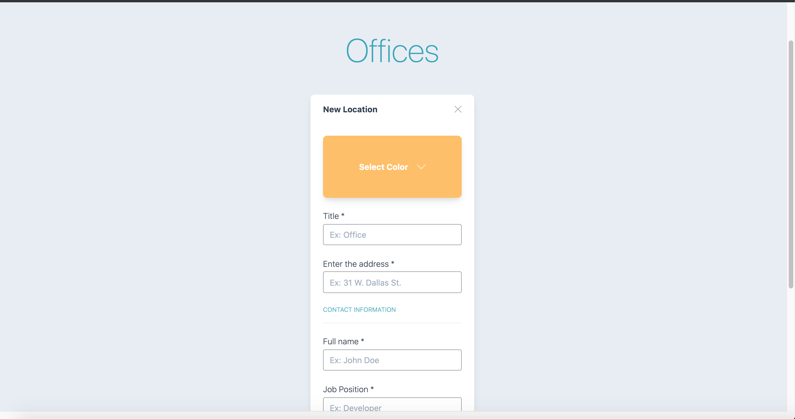

<h1 align="center">
    
</h1>

<h4 align="center"> 
    Test Senior Frontend Developer
</h4>

## :rocket: Technology

 
- [Node.js](https://nodejs.org/en/) 
- [Vue.js](https://jp.vuejs.org/)

## :computer: Projeto
The offices is an application to add and list offices.

## :page_with_curl: How to use
- **Clone the repository** `gt clone https://github.com/pablomagalhaes/theoffices`
- **Front-end** 
    - ```cd theoffices```
    - ```yarn```
    - ```yarn dev```

## :computer: Front-End Web :heavy_check_mark:

<h1 align="center">
    
</h1>

## :memo: License

This project is under the MIT license. See the archive [LICENSE](LICENSE) for details.